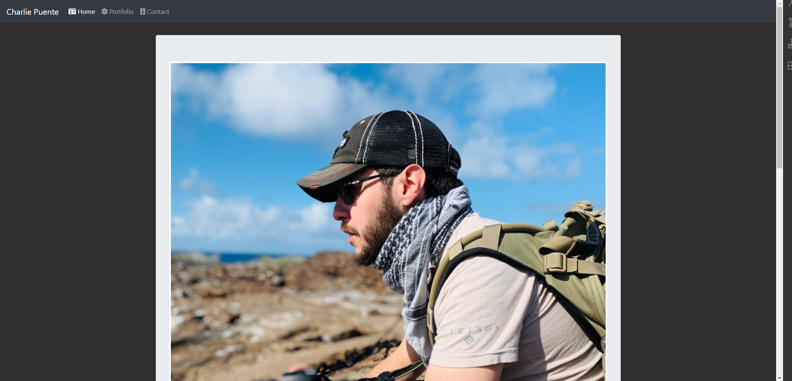
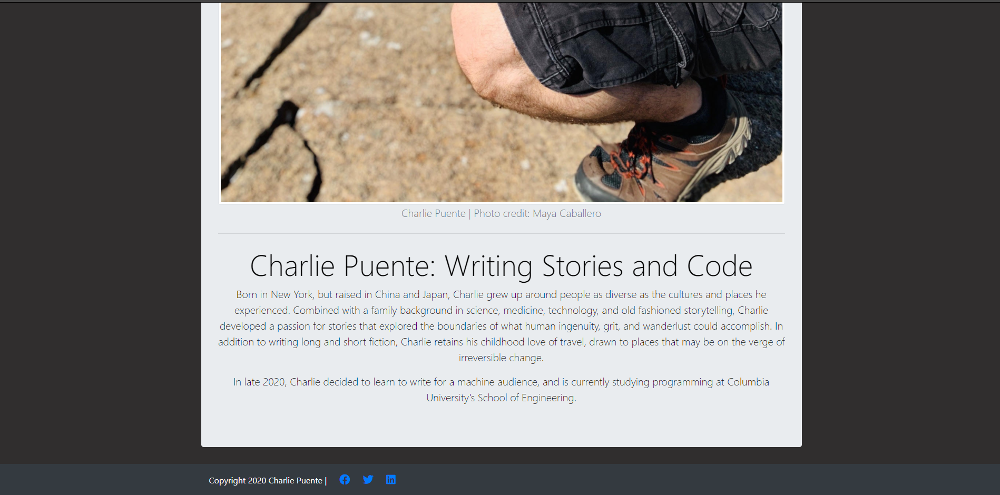
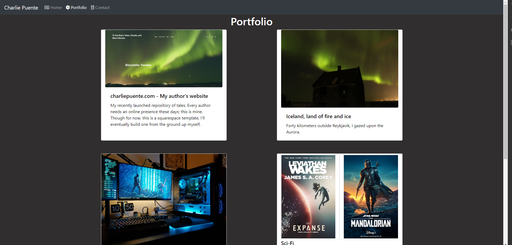
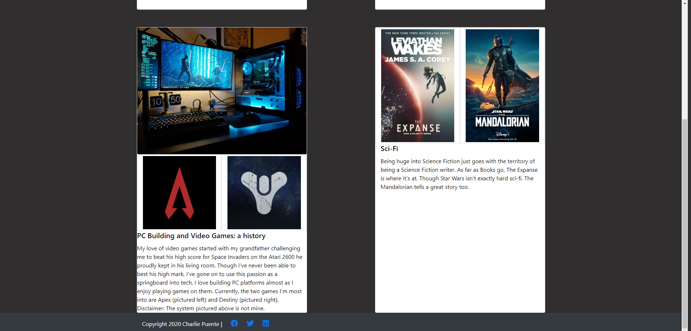
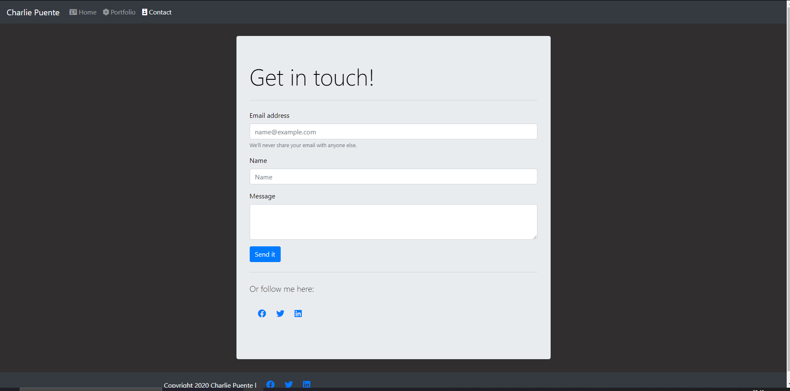

# Personal Portfolio

## Description

A responsive, multi-page portfolio made using HTML, CSS, Bootstrap's CSS/JS library, and JQUERY. Consisting of a home/about me page, a portfolio, and a contact page, the site is fully responsive, adapting to changes in screen size and device. Thanks to bootstrap, this is done with a minimum of custom CSS, while also adhering to a standardized grid layout.

## Features:

- Adaptable, persistent navbar that expands for larger pages, then shrinks to a collapsable format once a certain breakpoint is reached, allowing for easy navigation on any device.
- Standardized grid layout makes content easier to read
- Semantic HTML used where applicable for clarity
- Custom CSS used sparingly, making for a clean, easily navigable styling sheet.
- Site abides by accessibility standards
- Dynamically placed HTML content using JS lightens HTML footprint

## Screenshots:

## Link to Deployed Site:

[Deployed Site](https://puentebravo.github.io)

## Credits:

This project wouldn't be possible without the continued guidance of my Instructors at the Columbia University Coding Bootcamp. Profuse thanks are due to my awesome study group, whose assistance, peer review, and trouble shooting were critical to this project's success. We got this, y'all!

## License:

Content is governed by the Creative Commons Legal Code, spelled out in the included LICENSE file.

---

Copyright [2020] [Charlie Puente]
