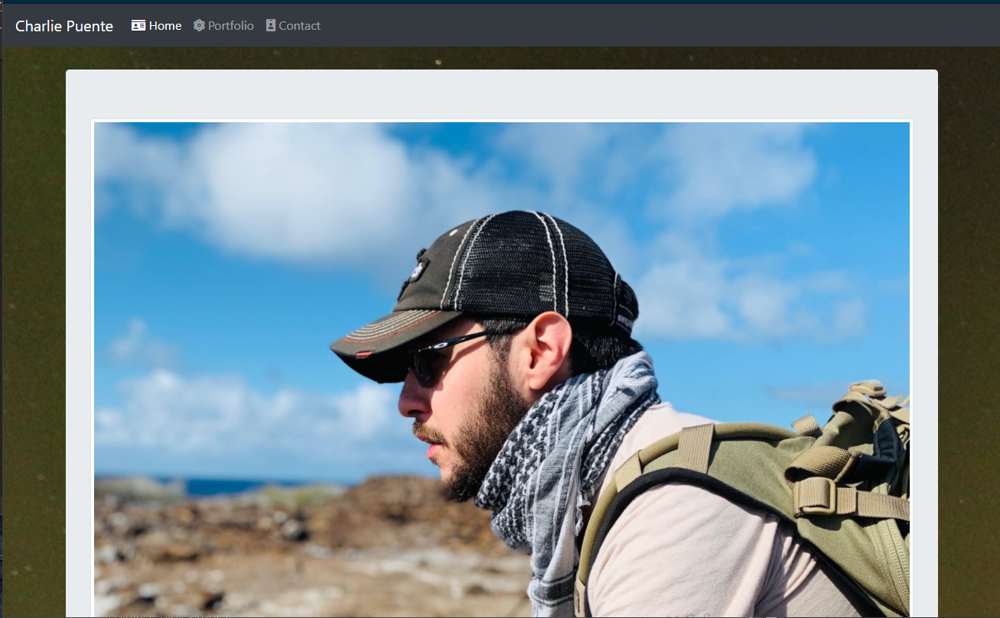
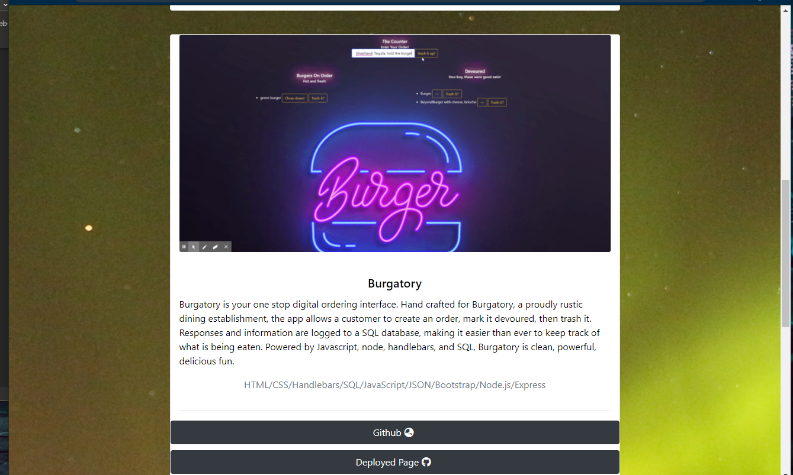

# Portfolio 
  
  ## Description 
      
  Made with Javascript and styled via bootstrap, this adaptive website serves as a showcase of my work so far as a developer.

  [You can view it here](https://puentebravo.github.io/)
      
  ## Table of Contents
      
  * [Installation](#installation)
  * [Usage](#usage)
  * [Credits](#credits)
  * [Contributing](#contributing)
  * [Questions](#questions)
  * [Tests](#tests)
  * [License](#license)
      
      
  ## Installation
      
  Navigate to the site, and use the navbar to look around. 
      
  ## Usage 
      
  Once on the website, you can view projects by clicking on their github and deployed buttons
      
  
  

  ## Credits
      
  I'd be remiss if I didn't thank my study group and my Instructors at the Columbia Engineering Coding Bootcamp. Without the help and guidance of both, none of this would exist.
      
  ## Contributing

  N/A

  ## Questions?
  
  Questions about this project can be directed to: 
  - Github: /puentebravo
  - Email: puentematos@gmail.com

  ## Tests

  N/A

  ## License
      
  Content in this project is governed under the CCLv1.0 License. 

  To read the license in its entirety, click here: [CCLv1.0](./LICENSE)

  -----------
  
  Copyright [2021] [Charlie Puente]